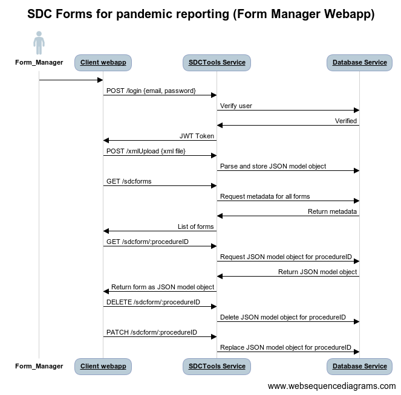
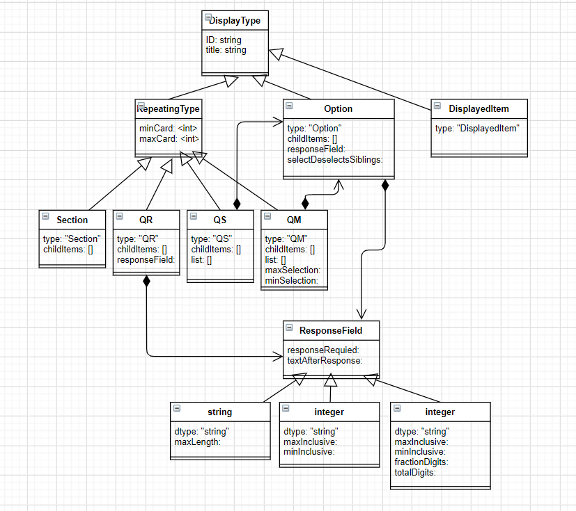
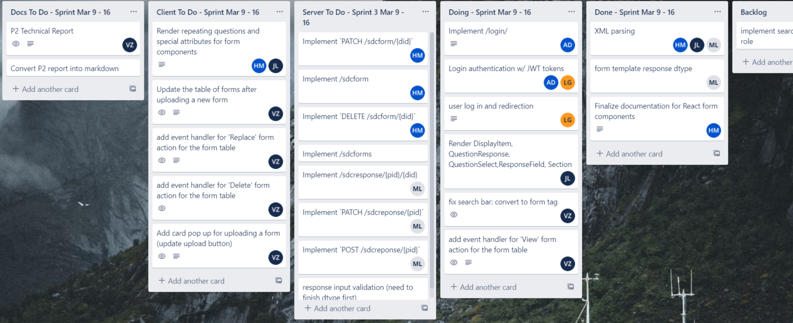

# Technical Product Report

---

## What did you actually build during this phase?

* Users login with authentication and are given a token for their session
* SDCTools Service that parses XML files into JSON objects
   * Determined database schema for form templates
* API routes for retrieving/replacing/deleting forms
* Form Manager page
   * Users can upload a xml file which gets saved as a parse JSON object and inserted
   * Display table of available forms and for each form the user can:
      * View, Replace, Delete
*  Rendering form from JSON object saved in the database
   * Retrieve form response values

### Form Manager Webapp:

In Phase 2, we built a Form Manager client webapp which calls into our SDCTools web service. There are two general user interaction flows for this webapp:

1. **Login:** To access the webapp, users log in and once authenticated, are
   granted a token for their session. The authentication process also
   implemented password hashing. This is served by the route “/login” [[link to
   source code](https://github.com/csc302-spring-2021/proj-Adultz/blob/password-hashing/server/index.js)]
2. **Client Webapp and SDCTools Service:** On the main page of the Form Manager webapp, the user can upload the XML file for a SDC Form which is parsed by the externalized SDCTools Service and stored in the database as a JSON object representing the form template. The webapp also displays a table of all available forms which is populated by fetching. For each form the user can view, replace or delete it. To view the form, an API call is made to fetch the JSON representation of the form template and then it is rendered by the React client. The user can also replace or delete the form. All the client interactions with the forms are serviced by the SDCTools API which creates, reads, replaces and deletes the JSON model objects of the forms in the database.

### Template Parser PR and source code: https://github.com/csc302-spring-2021/proj-Adultz/pull/21/files

### Rendering JSON representation of a SDC form in React: https://github.com/csc302-spring-2021/proj-Adultz/pull/24/files

### SDCTools Service - endpoints for externalized functionalities of dealing with SDC Forms: https://github.com/csc302-spring-2021/proj-Adultz/blob/main/server/index.js

### How is this different from what you originally proposed? Why?

Originally we had planned to cover the majority of the use cases for Form Manager, Filler and Receiver. We realized that parsing the XMLforms required research into the SDC Form schema and thus required more planning and discussion than previously anticipated. For this reason, we triaged the deliverables for P2 and decided to cover the use cases for Form Manager, as that entails both parsing the XML forms as well as rendering the resulting JSON form template in React.  By focusing on the use cases for Form Manager, we were able to finalize the form schemas and form rendering which will be fundamental as we progress into handling form responses and other use cases for Form Filler/Receiver.

---

## High-level design of your software.

This diagram shows the high-level design of our software as of Phase 2.

Diagram of form template schema, which was designed according to the SDC Basic Schema from the [Form Structure documentation](https://docs.google.com/document/d/1hi46ZkU3JwNFi3Y-RGgWyvcqGZ5o1Yd8axkFiyNRwzk/edit?usp=sharing).  This model was also utilized to plan out the front end components for rendering in React.

Link to diagram picture:
https://app.diagrams.net/#G1iSaP5fJgRRafUu919PRnUaJtyVy2uB9a

---

## Technical highlights: interesting bugs, challenges, lessons learned, observations, etc.

### Parsing XML to JSON:

Understanding the schema of the XML SDC forms was challenging at first and so we
researched for documentation on SDC forms to better comprehend the given XML
files. We mainly referenced the Structured Data Capture (SDC) Technical
Reference Guide [[link](https://drive.google.com/file/d/19WCZNMi-2zAtVVhXofRSZACg8KKNGCv7/view?usp=sharing)] to determine the structure of the SDC forms and what form components we needed to render. In particular, the SDC Basic Schema Types outlined what JSON schema the parsed XML file should follow.

This was all compiled into a detailed document [[link](https://docs.google.com/document/d/1hi46ZkU3JwNFi3Y-RGgWyvcqGZ5o1Yd8axkFiyNRwzk/edit?usp=sharing)] which was referred to when working on both backend and frontend code. It lists all the components that compose a SDC form, documentation on their attributes, the structure of the parsed JSON object from the XML and a model for storing the parsed form templates in the database. This shared documentation was extremely helpful to reference back to throughout P2 for the entire group as it defined every aspect of the form components.

### Defining the database schema for all the components of a SDC form structure:

The main schema defines a Mongoose model : FormTemplate. The FormTemplate model is the object that stores the parsed XML form inside our MongoDB database. This model consists of all the possible components of a SDC form, which in turn have their own schema defined as well.

Again this was finalized after reading through the Structured Data Capture (SDC) Technical Reference Guide and carefully deciding and planning the database schemas and models.

### Dynamically rendering React components from JSON:

We referenced this guide when learning how to dynamically render the form components from the parsed JSON file: https://www.storyblok.com/tp/react-dynamic-component-from-json .

* One interesting challenge was handling repeating form elements (i.e., when the attribute `maxCard > 1` for a given Section, Question etc.). For repeating elements the user can choose to add more elements by clicking `+Add…{element name}` and then repeated elements get inserted into the form template object adjacent to one another. The number of repeats is determined by counting the number of sibling objects with the same ID property.

---

## Reflect on your teamwork and process:

### What worked well:

* Having separate Discord channels for frontend and backend team members
* Breaking up frontend and backend to-dos into manageable and concrete tasks
* Having a retrospective meeting after P1, this helped to:
   * Create the backlog for P2
   * Identify strengths and weakness of the teamwork and process during P1
   * Requesting review from team members on Pull Requests before merging

### What needs improvement:

* Organizing and deciding on deliverables at the start of each phase
    * Focus more on planning small incrementative but valuable deliverables
* Focus on starting with a base of initial tasks and incrementing throughout the sprint
    * Have our increments be iterative so the team can adjust dynamically based on progress and feedback
* Having more consistent weekly scrum meetings that are well organized and directly address the root of what needs to be done

Link to our Trello board at the end of P2: https://trello.com/invite/b/D8fjUiXN/d9883cdec4a5437d39d179d388e5e439/csc302-project

---

## Triage: What will you build for phase 3, the final demo?

Since we have implemented  XML parsing, form rendering and form response value retrieval in React, we plan to finish covering the use cases for Form Filler and Form Receiver which all interact with the form responses. The important focus for phase 3 will be producing, storing and retrieving structured clinical notes described by the SDC form responses.

The final demo will showcase user login, authentication and redirection to a webapp based on their role (i.e., Form Manager, Filler or Receiver). For the form manager web app,  it will contain what was built in phase 2. For the form filler webapp, we will build more SDCTool Service endpoints for handling the SDC form responses. The form filler will be able to select a form to fill out for a patient and the form response will be stored as a structured clinical note for that patient’s electronic medical record. The form receiver will be able to open and view a form in a patient’s electronic medical record with the notes from the clinician (form filler) filled out.

Lastly, for the final demo we intend on deploying the application to a major cloud service provider (likely AWS) we wish to setup it up such that it is automatically able to be deployed just by pushing to a certain git branch, we also wish to setup a CI to ensure that all of the tests run pass in a more consistent environment.
